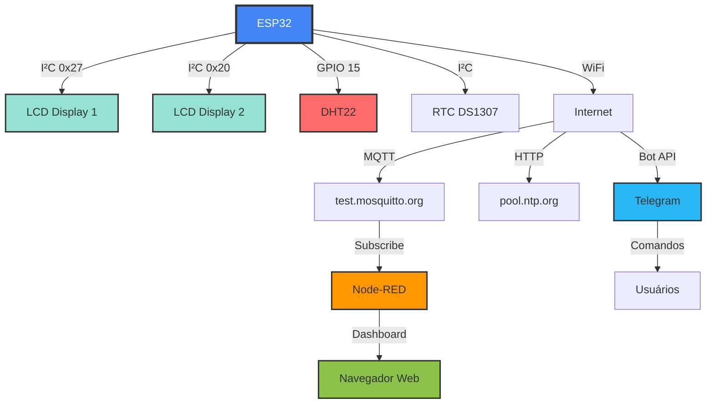

# 🌡️ Sistema de Monitoramento Inteligente DHT22

<div align="center">


**Sistema completo de sensoriamento e transmissão de dados com ESP32**

[Acessar Simulação](https://wokwi.com/projects/444377926004046849) •
[Ver Dashboard](#) •
[Telegram Bot](#telegram-bot)

</div>

---

## 📋 Índice

- [Sobre o Projeto](#-sobre-o-projeto)
- [Tecnologias Utilizadas](#-tecnologias-utilizadas)
- [Arquitetura do Sistema](#-arquitetura-do-sistema)
- [Funcionalidades](#-funcionalidades)
- [Hardware](#%EF%B8%8F-hardware)
- [Configuração](#-configuração)
- [Dashboard](#-dashboard)
- [Bot Telegram](#-bot-telegram)
- [Equipe](#-equipe)
- [Licença](#-licença)

---

## 🎯 Sobre o Projeto

Sistema IoT completo desenvolvido para a disciplina **Sensoriamento & Modern Prototyping** do curso de **Engenharia Mecatrônica** da **FIAP**, que integra:

- ⏱️ **Leitura periódica** de temperatura e umidade (a cada 3 segundos)
- 📊 **Visualização em tempo real** através de displays LCD 20x4
- 🌐 **Transmissão via MQTT** para broker público
- 📱 **Bot Telegram** com comandos interativos e envio automático
- 🖥️ **Dashboard Node-RED** com gráficos e estatísticas
- 🕐 **Sincronização automática** com servidor NTP
- 📈 **Histórico de 24 horas** com cálculo de máximas, mínimas e médias

---

## 🚀 Tecnologias Utilizadas

### Hardware Virtual (Wokwi)

```
🔷 ESP32 DevKit V1
├─ Microcontrolador dual-core com WiFi/Bluetooth
└─ Clock: 240 MHz | RAM: 520 KB

🌡️ DHT22 (AM2302)
├─ Sensor digital de temperatura e umidade
├─ Precisão: ±0.5°C / ±2% RH
└─ Range: -40~80°C | 0~100% RH

🕐 RTC DS1307
├─ Relógio de tempo real com bateria
└─ Sincronização automática via NTP

📺 2x LCD 20x4 I²C
├─ Endereços: 0x27 e 0x20
└─ Interface I²C (apenas 2 fios)
```

### Software & Protocolos

<table>
  <tr>
    <td align="center"><strong>🔌 MQTT</strong></td>
    <td align="center"><strong>🤖 Telegram</strong></td>
    <td align="center"><strong>📊 Node-RED</strong></td>
    <td align="center"><strong>🌐 NTP</strong></td>
  </tr>
  <tr>
    <td>Broker público<br/>test.mosquitto.org</td>
    <td>API de Bot<br/>Comandos interativos</td>
    <td>Dashboard 2.0<br/>Visualização em tempo real</td>
    <td>pool.ntp.org<br/>UTC-3 (Brasil)</td>
  </tr>
</table>

### Bibliotecas Arduino

```cpp
• Wire.h                 // Comunicação I²C
• LiquidCrystal_I2C.h   // Controle dos displays LCD
• RTClib.h              // Manipulação do RTC DS1307
• DHTesp.h              // Leitura do sensor DHT22
• WiFi.h                // Conectividade WiFi ESP32
• PubSubClient.h        // Cliente MQTT
• time.h                // Sincronização NTP
```

---

## 🏗️ Arquitetura do Sistema



### Fluxo de Dados

```
┌─────────────┐
│   DHT22     │ ──► Leitura a cada 3s
└──────┬──────┘
       │
       ▼
┌─────────────┐
│   ESP32     │ ──► Processa e valida dados
└──────┬──────┘
       │
       ├──► Display 1: Dados em tempo real
       ├──► Display 2: Estatísticas 24h
       ├──► MQTT: Transmissão para broker
       └──► Telegram: Comandos e relatórios
              │
              ▼
       ┌─────────────┐
       │  Node-RED   │ ──► Dashboard com gráficos
       └─────────────┘
```

---

## ✨ Funcionalidades

### 📊 Display 1 - Dados em Tempo Real

```
┌────────────────────┐
│ Data: 17/10/2025   │
│ Hora: 20:40:15     │
│ Temp: 24.5°C       │
│ Umid: 65.2%        │
│ W+ M+ S+ N+        │ ← Status: WiFi, MQTT, Sensor, NTP
└────────────────────┘
```

### 📈 Display 2 - Estatísticas 24h

```
┌────────────────────┐
│ << Estatisticas >> │
│ 17/10 20:40:15     │
│ T:28.3° 22.1°      │ ← Tmax / Tmin
│ U:75.1% 58.4%      │ ← Umax / Umin
└────────────────────┘
```

### 🤖 Bot Telegram

#### Comandos Disponíveis

| Comando | Descrição | Resposta |
|---------|-----------|----------|
| `/Dados` ou `/dados` | Última medição | Temp, Umid e horário |
| `/Média` ou `/media` | Estatísticas do período | Média e total de leituras |
| `/Display2` | Máximas e mínimas | Valores extremos 24h |
| `/Status` | Status do sistema | WiFi, MQTT, Sensor, Histórico |
| `/Ajuda` | Menu de ajuda | Lista de comandos |

#### 📅 Relatório Automático

- **Horário:** 20h40 (Turma 1EMR)
- **Destinatário:** Professor Marcelo Morgantini
- **Conteúdo:** Dados completos do Display 2
- **Formato:** Markdown formatado

**Exemplo de mensagem:**

```
📊 RELATÓRIO DIÁRIO - DHT22
══════════════════════════════

📅 Data/Hora: 17/10/2025 20:40:15
⏱️ Período: 24.0 horas

🌡️ TEMPERATURA
   • Máxima: 28.3°C 🔴
   • Mínima: 22.1°C 🔵

💧 UMIDADE
   • Máxima: 75.1% 💦
   • Mínima: 58.4% ☀️

══════════════════════════════
Relatório automático enviado às 20h40
```

### 🖥️ Dashboard Node-RED

#### Recursos Visuais

- **📊 Cards de Estatísticas**
  - Temperatura Média
  - Umidade Média
  - Máximas e Mínimas
  - Com gradientes coloridos

- **📈 Gráfico Combinado**
  - Temperatura e Umidade no mesmo gráfico
  - Últimas 50 leituras (~2.5 minutos)
  - Atualização em tempo real

- **📋 Tabela de Histórico**
  - 10 últimas leituras
  - Ordenação: mais recente no topo
  - Formatação com hora precisa

- **🎯 Indicadores de Condição**
  - Temperatura: Cold / Ideal / Hot / Danger
  - Umidade: Very Dry / Dry / Ideal / Too Wet
  - Destaque visual da condição atual

---

## 🛠️ Hardware

### Diagrama de Conexões

```
ESP32 DevKit V1
    │
    ├─ GPIO 21 (SDA) ──┬─► LCD1 (0x27)
    │                  ├─► LCD2 (0x20)
    │                  └─► RTC DS1307
    │
    ├─ GPIO 22 (SCL) ──┴─► Barramento I²C
    │
    └─ GPIO 15 ────────────► DHT22 (Data)

Alimentação:
    VCC (3.3V) ─────────┬─► DHT22
                        ├─► LCD1
                        ├─► LCD2
                        └─► RTC DS1307
    
    GND ─────────────────┴─► Comum (todos)
```

### Lista de Componentes

| Qtd | Componente | Especificação |
|:---:|-----------|---------------|
| 1 | ESP32 DevKit V1 | Microcontrolador principal |
| 1 | DHT22 (AM2302) | Sensor temp/umidade |
| 1 | RTC DS1307 | Relógio em tempo real |
| 2 | LCD 20x4 I²C | Displays endereços 0x27 e 0x20 |
| 1 | Protoboard 830 pts | Montagem dos circuitos |
| - | Jumpers | Conexões |

### Consumo de Energia

- **ESP32:** ~160mA (WiFi ativo)
- **DHT22:** ~1.5mA
- **RTC DS1307:** ~1.5mA
- **LCD 20x4 (x2):** ~20mA cada
- **Total:** ~203mA @ 3.3V

---

## 📊 Dashboard

### Acessando

```
http://localhost:1880/dashboard/cp03
```

### Seções do Dashboard

#### 🎨 Header
- Logos: FIAP, Grupo Enki, Wokwi
- Link para projeto Wokwi

#### 🌡️ Temperatura
- Gauge semicircular
- Valor numérico grande
- Tabela de condições com destaque
- Gráfico histórico (1 hora)

#### 💧 Umidade
- Gauge semicircular
- Valor numérico grande
- Tabela de condições com destaque
- Gráfico histórico (1 hora)

#### 📊 Complete Statistics
- **6 Cards Coloridos:**
  - Temp Média (gradiente roxo)
  - Umid Média (gradiente rosa)
  - Temp Máx (gradiente laranja)
  - Temp Mín (gradiente azul claro)
  - Umid Máx (gradiente ciano)
  - Umid Mín (gradiente verde)

- **Gráfico Combinado:**
  - Temperatura (laranja)
  - Umidade (azul)
  - Últimas 50 leituras
  - Auto-scroll

- **Tabela de Histórico:**
  - 10 últimas leituras
  - Mais recente no topo
  - Colunas: Hora, Temp, Umid

### Recursos Interativos

- ✅ Auto-refresh a cada 10 segundos
- ✅ Gráficos responsivos
- ✅ Cores dinâmicas baseadas em condições
- ✅ Botão para limpar dados (em desenvolvimento)

---

## 🎓 Informações Acadêmicas

### Disciplina
**Sensoriamento & Modern Prototyping**

### Professor
**Marcelo Morgantini**

### Instituição
**FIAP - Faculdade de Informática e Administração Paulista**

### Curso
**Engenharia Mecatrônica**

### Turma
**1EMR**

---

## 👥 Equipe

<table>
  <tr>
    <td align="center">
      <strong>Henrique Augusto Cruz</strong><br>
      <sub>RM 564586</sub><br>
      🎯 Desenvolvedor Principal
    </td>
    <td align="center">
      <strong>Leonardo Eiji</strong><br>
      <sub>RM 562934</sub><br>
      🔧 Hardware & Testes
    </td>
    <td align="center">
      <strong>Breno Martins da Silva</strong><br>
      <sub>RM 563685</sub><br>
      📊 Dashboard & Integração
    </td>
  </tr>
</table>

---

## 🌟 Diferenciais do Projeto

### ✨ Código Otimizado

- **Arquitetura Modular:** Separação clara entre hardware e lógica
- **Gestão de Memória:** Uso eficiente com strings estáticas
- **Non-blocking:** Sistema nunca trava, mesmo sem conexão
- **Validação Robusta:** Todos os dados validados antes do uso

### 🔄 Sincronização Inteligente

- **NTP Automático:** Sincroniza ao conectar WiFi
- **Ressincronização:** A cada 1 hora automaticamente
- **Fallback:** Mantém hora local se NTP falhar

### 📱 Bot Telegram Avançado

- **Menu Interativo:** Botões clicáveis para comandos
- **Comandos Case-Insensitive:** Aceita maiúsculas e minúsculas
- **Grupo ou Individual:** Suporta ambos os modos
- **Markdown Formatado:** Mensagens bonitas e legíveis

### 📊 Dashboard Profissional

- **Design Moderno:** Gradientes e cards coloridos
- **Responsivo:** Adapta-se a diferentes telas
- **Tempo Real:** Atualização automática
- **Estatísticas Completas:** Todas as métricas importantes

---

## 🔍 Monitoramento e Debug

### Serial Monitor

Mensagens estruturadas com símbolos visuais:

```
╔════════════════════════════════════════╗
║   SISTEMA INICIALIZADO ✓              ║
╚════════════════════════════════════════╝

✓ Wi-Fi conectado
✓ MQTT conectado
✓ RTC sincronizado com NTP
✓ DHT22 operacional

━━━━━━━━━━━━━━━━━━━━━━━━━━━━━━━━━━━━━
📊 Temp: 24.5°C | Umid: 65.2%
📈 Max: T=28.3°C U=75.1% | Min: T=22.1°C U=58.4%
```

### Status Visual nos Displays

```
W+ M+ S+ N+  ← Todos OK
W- M- S- N-  ← Todos OFF
W+ M- S+ N+  ← MQTT offline
```

**Legenda:**
- `W` = WiFi
- `M` = MQTT
- `S` = Sensor DHT22
- `N` = NTP Sync

---

## 🚀 Melhorias Futuras

- [ ] **Alertas por Telegram:** Notificações quando valores ultrapassarem limites
- [ ] **SD Card Logger:** Backup local dos dados
- [ ] **Interface Web Local:** Configuração via browser
- [ ] **OTA Updates:** Atualização remota do firmware
- [ ] **Gráficos no Display:** Mini-gráficos no LCD
- [ ] **Modo Deep Sleep:** Economia de energia com bateria
- [ ] **Múltiplos Sensores:** Expansão para DHT22 adicionais
- [ ] **Banco de Dados:** InfluxDB para histórico longo

---

## 📝 Licença

Este projeto foi desenvolvido para fins educacionais como parte do curso de Engenharia Mecatrônica da FIAP.

**MIT License** - Livre para uso, modificação e distribuição.

---

## 🔗 Links Úteis

- 📌 [Projeto Wokwi](https://wokwi.com/projects/444377926004046849)
- 📚 [Documentação ESP32](https://docs.espressif.com/projects/esp-idf/en/latest/esp32/)
- 📖 [DHT22 Datasheet](https://www.sparkfun.com/datasheets/Sensors/Temperature/DHT22.pdf)
- 🤖 [Telegram Bot API](https://core.telegram.org/bots/api)
- 📊 [Node-RED Dashboard](https://flows.nodered.org/node/@flowfuse/node-red-dashboard)
- 🌐 [MQTT Broker](https://test.mosquitto.org/)

---

## 💬 Contato

Para dúvidas ou sugestões sobre o projeto:

- **Professor:** Marcelo Morgantini
- **Instituição:** FIAP - Campus Aclimação
- **Disciplina:** Sensoriamento & Modern Prototyping

---

<div align="center">

**⭐ Desenvolvido com dedicação pela equipe 1EMR**

**FIAP - Engenharia Mecatrônica - 2025**


</div>
